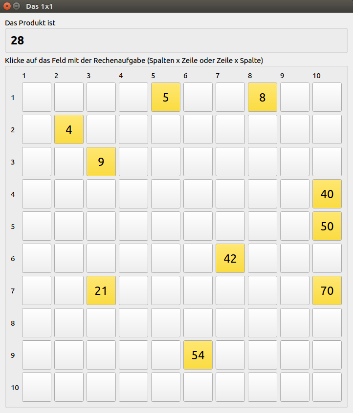

# Rechenmeistertrainer
Ein Mathetrainer für die Grundschule (1x1 und sowas).

## Wie funktioniert der?

1. Programm starten (siehe unten)
2. Namen eingeben
3. Ein-mal-Eins Aufgabe starten
4. Nach 5 Minuten oder wenn alle 100 Aufgaben gelöst sind, wird die Auswertung angezeigt und man sieht ein Diagramm der Lernleistung... mehr Übung = mehr Aufgaben richtig gelöst = mehr Punkte!



## Download/Installation

### Windows
- zip-Datei Herunterladen, entpacken und `Rechenmeistertrainer.exe` starten

### Linux

QtCreator verwenden, Projektdatei `build/Qt/Rechenmeistertrainer.pro` öffnen und bauen.

#### In der Kommandozeile bauen

1. Qt 5.10 oder neuer von Qt herunterladen und installieren (wegen Multimedia-support)

2. Quelltext übersetzen

```bash
# in Rechenmeistertrainer root dir
$ cd build/Qt
$ export PATH=/path/to/Qt5.10/bin:$PATH
$ qmake Rechenmeistertrainer.pro
$ make
```

3. LD_LIBRARY-Pfad zur qwt-lib setzen und Programm starten

```bash
# in Rechenmeistertrainer root dir
$ export LD_LIBRARY_PATH=externals/lib_x64
$ bin/release_x64/Rechenmeistertrainer
```
