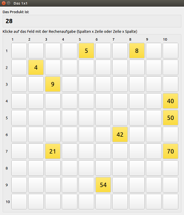

# Calculation Wizard (german: Rechenmeistertrainer)
A mind calculation trainer for elementary school kids (helps to practice the 1x1).

## How does it work?

1. Download and start program (see below)
2. Enter/select your name
3. Start the 1x1 quiz
4. After 5 minutes, or when all 100 problems are solved, the results are shown and the diagram with your learning progress is updated... more practice = more problems solved = more points!

### Screen during the test


### Learning progress


More screenshots are in the doc-directory.

### Highscore and statistics

After every run (max. 5 minutes) a highscore is shown with the following equation:

```
duration_with_penalty = duration_in_seconds + not_completed*ERROR_PENALTY
score = 100000/duration_with_penalty - 124
```

`not_completed` is the number of not-yet-solved problems (empty fields, max 100). 
`ERROR_PENALTY` is a time penalty (5 seconds). Hence, the max value for duration_with_penalty is 800 = (300 + 5*100) and 100000/800 = 125 -> score = 1

Für every test run the name, date/time, duration and number of unsolved problems (free tiles) is stored. The information is stored in a csv-file (tab-separated), which is writen into the user's home directory:

- Windows: `%HOME%/AppData/Roaming/Rechenmeister/statistics.csv`
- Unix/Linux: `~/.local/share/Rechenmeister/statistics.csv`

## Download/Installation

### Windows
- download zip-file, extract, run `Rechenmeistertrainer.exe`

### Linux

#### Ubuntu 16.04 or newer
- download tar.gz-file, install dependencies (packaged, see INSTALL-file inside the archive)
- start `Rechenmeistertrainer` binary

#### General

- install qt5 and qwt dev packages
- use QtCreator, open project/session file `build/Qt/Rechenmeistertrainer.pro` and build

or in the command line

```bash
# in Rechenmeistertrainer root dir
$ cd build/Qt
$ qmake Rechenmeistertrainer.pro
$ make
```


