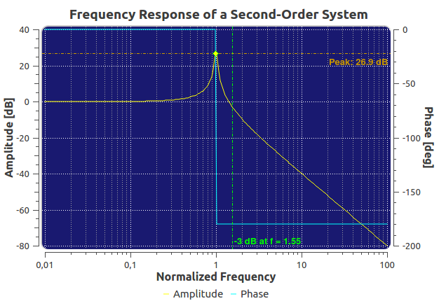
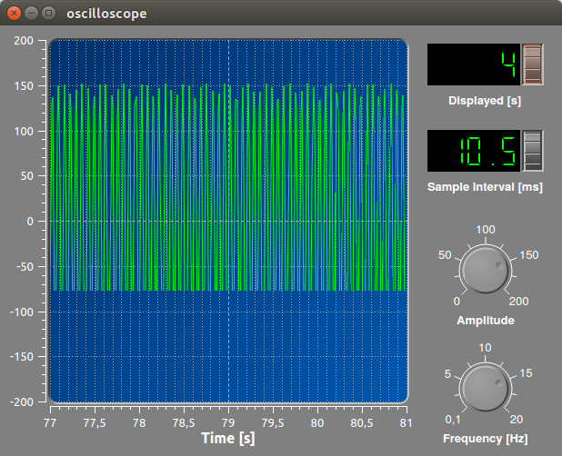

# Das Qwt (Hand-)Buch

Qwt (_Qwt - Qt Widgets for Technical Applications_) ist eine Bibliothek für technische Anwendungen und stellt
bestimmte Widgets für Anzeigen und Kontrollkomponenten bereit.
Die wohl wichtigste Komponente der Qwt Bibliothek ist das `QwtPlot`,
eine sehr flexible und mächtige Diagrammkomponente.



Die Qwt Bibliothek steht unter eine OpenSource Lizenz und wird auf
SourceForge.net gehostet:

- [Qwt Webseite (englisch)](http://qwt.sourceforge.net)
- [Qwt SourceForge Projektseite](https://sourceforge.net/projects/qwt)

## Allgemeines über die Bibliothek

### Entwicklungsgeschichte

- kleiner Abriss über die Historie, aktuellen Maintainer, Entwicklungsziele und ...

### Download der Bibliothek

Die Qwt Bibliothek kann von der [Qwt SourceForge Projektseite](https://sourceforge.net/projects/qwt) als Quelltextarchiv
geladen werden. Unter Linux wird Qwt bei vielen Distributionen als Paket gehalten. Genau genommen gibt es mehrere Pakete für die unterschiedlichen Qwt-Bibliotheksversionen.

**Ubuntu 16.04.4 LTS**:

```bash
# Qwt 5.x unter Verwendung von qt4 (für Qwt 5.2.3-1)
apt install libqwt5-qt4-dev

# Qwt 6.x unter Verwendung von qt5 (für Qwt 6.1.2-5)
apt install libqwt-qt5-dev
```

## Widget-Konzept und Erscheinungsbild

Die Qwt Bibliothek liefert Komponenten, welche analog zu Standard Qt-Widgets in Deskopanwendungen verwendet werden können. Die Komponenten verwenden die vom jeweiligen Stil definierten Paletteneinstellungen, sodass die Qwt-Widgets in die jeweilige Oberfläche passen. Dadurch integrieren sich die Widgets nahtlos in Programmoberflächen. Abrundungseffekte beim Plot ermöglichen das Immitieren klassischer Anzeigen:



Bei den Kontroll-Komponenten wird die Farbgebung über Palettenrollen definiert, z.B. bei den Zeigerkontrollen (`QwtDial`) via `QPalette::WindowText` (der Hintergrund der inneren Fläche) und `QPalette::Base` (die Grundfarbe des äußeren Ringes) und `QPalette::Text` (die Schriftfarbe):


In ähnlicher Weise können auch Gradienten benutzt werden, um ein plastisches Erscheinungsbild zu erzeugen:


Bei der `QwtPlot`-Komponente betrifft das alle Teile, die außerhalb der eigentlichen Zeichenfläche liegen. Das heißt

- Titel,
- außenliegende Legende,
- Achsen, und
- Diagrammrahmen (einschließlich des möglichen 3D Rahmeneffekts)

werden durch die Paletten-Eigenschaften des Plotwidgets beeinflusst (siehe Beschreibung der relevanten Funktionen in [Rahmen und Zeichenfläche](basics/#rahmen-und-zeichenflache))

## Besitzer/Eigentümer-Konzept des QwtPlot-Widgets

Eine grundlegende Eigenschaft der `QwtPlot`-Klasse ist die Besitzübername hinzugefügter Elemente. Dies gilt allgmein für Zeichenobjekte, die Legende etc. Einmal hinzugefügte Elemente können nicht wieder losgelöst werden (bzw. nur über einen Trick, wie im Kapitel [Fortgeschrittenes](advanced) beschrieben wird). Daher ist es sinnvoll bei veränderlichen Diagrammelementen einen Mechanismus zur jeweiligen Neuerstellung eines Zeichenobjekts  vorzusehen (Factory-Konzept).

Beispiel:
```c++
void Plot::updateLegend() {
    QwtLegend * legend = new Qwtlegend();
    // Legendeneigenschaften setzen
    ...

    // Legende in Diagramm ersetzen (alte Legende wird gelöscht)
    insertLegend(legend);
}
```
## Zeichenobjekte und deren Achsenabhängigkeit

Ein wesentliches Designmerkmal beim `QwtPlot` ist die Möglichkeit, beliebige Zeichenobjekte (Kurven, Marker, Legende, ...) dem Plot zu übergeben. Damit sich diese Zeichenobjekte (engl. _PlotItem_) am Koordinatengitter ausrichten können, ist es möglich ihnen eine Achsenabhängigkeit zu geben. Dadurch erhalten diese Zeichenobjekte eine Information, wann immer sich die Achsenskalierung ändert (durch Zoomen, oder Änderung der Wertebereiche etc.).

Diese Funktionalität definiert die zentrale Bedeutung der (bis zu) 4 Achsen im Diagramm. Deswegen sind diese auch fest im `QwtPlot` verankert und werden nicht wie andere Zeichenobjekte beliebig hinzugefügt.

## Vererbungskonzept

Grundsätzlich ist das `QwtPlot` und die beteiligten Klassen auf maximale Anpassungsfähigkeit ausgelegt, d.h. es wird (fast) überall Polymorphie unterstützt. Wenn die eingebaute Funktionalität nicht zureichend ist, kann man einfach immer die entsprechende Klasse ableiten und die jeweils anzupassende Funktion re-implementieren und verändern (siehe Kapitel [Anpassungen](customization)).

## Verwendung der Designer Plugins

Die Qwt Bibliothek bringt Plugins für Qt Designer mit, welche das Einfügen von Qwt-Komponenten in ui-Dateien erleichtert. Es lassen sich jedoch keine QwtPlot-Eigenschaften festlegen oder Kurven hinzufügen. Die eigentliche Anpassung und Ausgestaltung des Plots erfolgt im Quelltext. Deswegen wird die Konfiguration und Anpassung des `QwtPlot` in diesem Handbuch ausschließlich durch normale API-Aufrufe demonstriert.

> **Hinweis:** Soll das QwtPlot auch ohne Designer-Plugins im grafischen QtDesigner-Editor eingefügt werden, kann man einfach ein QWidget einfügen und dieses als Platzhalter für die `QwtPlot`-Klasse definieren.

TODO : Beschreibung, wie Designer plugins erstellt und in Qt Creator/Designer integriert werden.

---

_Autoreninfo: Schreibkonventionen_:

- `QwtDial` - Qwt-Klassen im Fließtext immer als Code-Schnipsel
- Quelltextblöcke immer mit c++ Hervorhebung einfügen (Dreifach schräges Hochkomma)
- Bilder ohne Skalierung einfügen (Skalierung erfolgt durch CSS)
